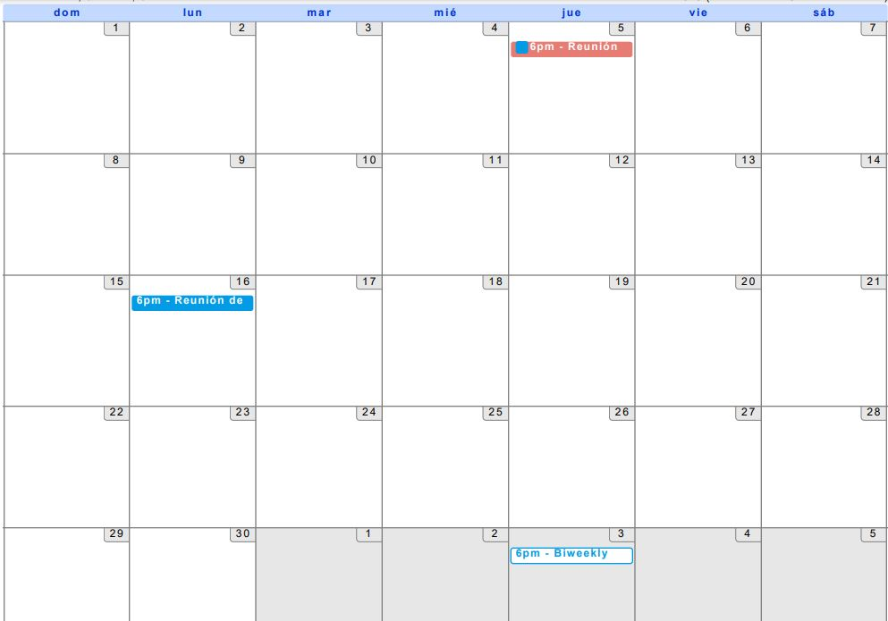
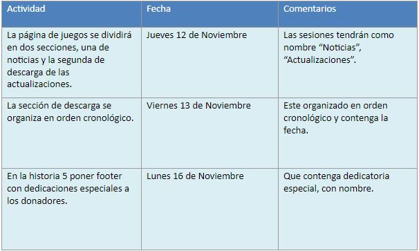
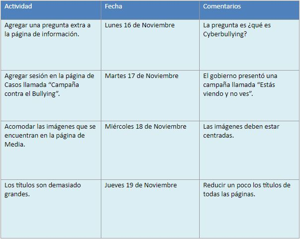
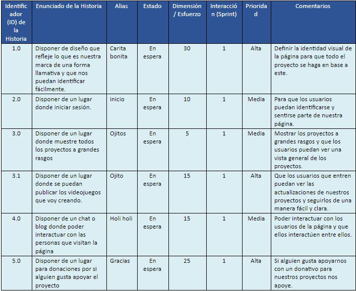
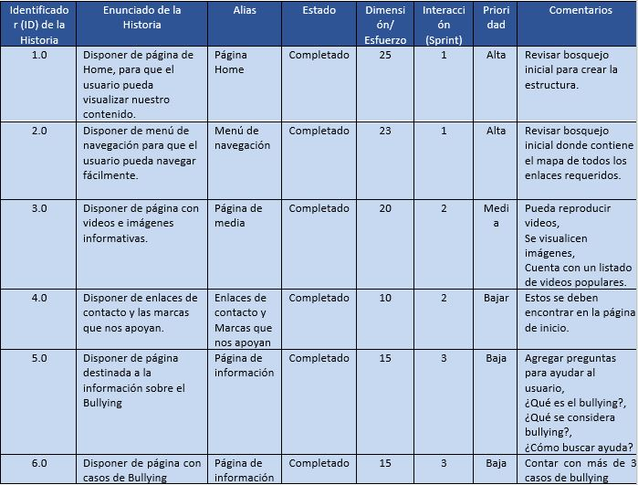

## Actividad 1. Reunión de revisión inicial.

***

### Calendario De Reuniones:
* Jueves 12 de noviembre 2020, 6:00pm, 7:00pm, Duración 60 minutos.
* Lunes 16 de noviembre 2020, 6:00pm, 7:00pm, Duración 60 minutos.

Calendario: 

***
***
## Reunión de revisión inicial 1

#### Fecha: Jueves 12 de noviembre 2020, 6:00pm, 7:00pm, Duración 60 minutos.

Repartición de roles:     

| Product Owner (PO)       | Scrum Master (SM)          | Desarrollador  |
| ------------- |:-------------:| -----:|
| Mayra     | Elizabeth | Mayra |

 
### Proyecto: Creando un sueño, creando videojuegos
### Las propuestas de modificaciones: 

***
***

## Reunión de revisión inicial 2
Fecha: Lunes 16 de noviembre 2020, 6:00pm, 7:00pm, Duración 60 minutos.

Repartición de roles:     

| Product Owner (PO)       | Scrum Master (SM)          | Desarrollador  |
| ------------- |:-------------:| -----:|
| Elizabeth    | Mayra | Elizabeth |

### Proyecto: PrevenciónDelAcoso.com
### Las propuestas de modificaciones: 

***
***

### Product backlog:

#### Proyecto: Creando un sueño, creando videojuegos

### Product backlog:

### Proyecto: PrevenciónDelAcoso.com

# Actividad-1.-Reuni-n-de-revisi-n-inicial
